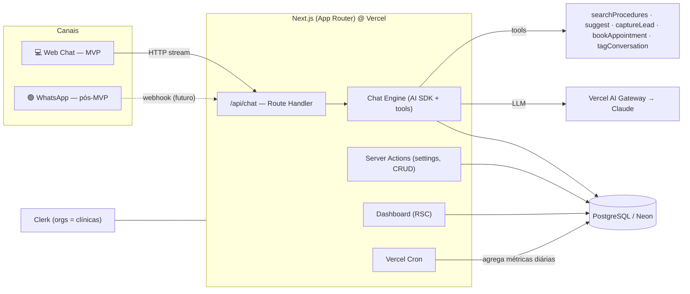
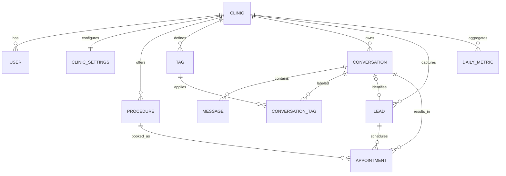

# DentalTrack — CRM Conversacional com IA para Clínicas
## `context.md` · Especificação de Produto (v1 — MVP)

> Fonte única de verdade sobre **o quê** e **o porquê** do produto.
> O **como** (execução técnica, fases e tarefas) está em [`plan.md`](./plan.md).
> Status: MVP · Data base: 2026-06-04

---

## 1. Visão geral

**DentalTrack** é uma plataforma de **CRM conversacional** que coloca um **agente de IA** (chatbot inteligente) na linha de frente do atendimento de **clínicas odontológicas de pequeno e médio porte**. O agente conduz o paciente pelos fluxos típicos da clínica — tirar dúvidas sobre procedimentos, receber sugestões personalizadas e **agendar consultas** — enquanto a plataforma transforma cada interação em dado estruturado (leads, tags de interesse, status da conversa) e devolve ao dono da clínica um **dashboard de gestão** claro e acionável.

| | |
|---|---|
| **Canal de produção (visão)** | **WhatsApp** — é onde o chatbot vai efetivamente atuar com os pacientes. |
| **Canal deste MVP (1º entregável)** | **Web** — o mesmo motor de chatbot rodando numa interface web, **sem** dependência do WhatsApp **por enquanto**. |
| **Princípio de arquitetura** | *Channel-agnostic*: o motor de conversa não sabe se o canal é Web ou WhatsApp. Ativar o WhatsApp depois é uma **integração de borda**, não uma reescrita. |

---

## 2. Problema & proposta de valor

**Problema.** Clínicas de pequeno/médio porte perdem leads porque o atendimento é manual, lento e fora do horário comercial. A recepção não dá conta de responder, qualificar e agendar ao mesmo tempo, e o dono não tem visibilidade de quantos pacientes chegaram, o que pediram e quantos viraram consulta.

**Proposta de valor.**
- **Para o paciente:** resposta imediata, 24/7, que entende a dúvida e já encaminha para o agendamento.
- **Para o dono da clínica:** um vendedor digital que nunca dorme + um painel que mostra leads, interesses (tags) e taxa de conversão em tempo real.
- **Diferencial:** não é um chatbot de árvore de decisão. É um agente de IA com linguagem natural, **configurável pela própria clínica** e que **aprende o perfil de interesse** de cada conversa via tags.

---

## 3. Público-alvo & personas

| Persona | Quem é | Dores | O que espera do produto |
|---|---|---|---|
| **Dona/Dono da clínica** (admin) | Dentista-proprietário ou gestor. Pouco tempo, sem time de marketing. | Não sabe quantos leads chega, nem o que convertem. Atendimento depende de pessoas. | Configurar o bot em minutos e ver no dashboard o que está acontecendo. |
| **Recepção / Secretária** (operador) | Faz o atendimento hoje. | Sobrecarga de mensagens repetitivas. | Que o bot filtre e qualifique; ela cuida só do que precisa de humano. |
| **Paciente / Lead** (usuário final) | Pessoa interessada num procedimento. | Quer resposta rápida e marcar sem ligar. | Conversa natural que resolve e agenda. |

---

## 4. Escopo do MVP

### 4.1 Dentro do escopo ✅
1. **Chatbot inteligente (Web)** com os fluxos de clínica: dúvidas sobre procedimentos, sugestão de procedimentos e **agendamento**.
2. **Dashboard de gestão** para o dono da clínica, com KPIs e gráficos.
3. **Configurações do chatbot** (identidade da clínica, ofertas, instruções específicas, procedimentos).
4. **Sistema de tags** automático por interesse (ex.: implante, faceta de porcelana).
5. **Captura de leads** e registro de conversas/mensagens.
6. **Multi-clínica** (multi-tenant) — base preparada para mais de uma clínica.

### 4.2 Fora do escopo (este MVP) ⛔
- **Integração real com WhatsApp** → arquitetada, **não ativada** (ver §11 Roadmap).
- Agenda/calendário real com slots e confirmação (o agendamento gera um **lead qualificado + pedido de agendamento**, não um slot sincronizado com Google Calendar).
- Pagamentos, prontuário/anamnese clínica, billing/assinatura da plataforma.
- App mobile nativo, automações de marketing (disparos em massa), múltiplos idiomas.

> **Regra de ouro do MVP:** o chatbot precisa conduzir bem o fluxo de clínica **em web**, e o dashboard precisa contar essa história com dados reais.

---

## 5. Funcionalidades (os 4 pilares)

### 5.1 Pilar 1 — Chatbot inteligente
Agente de IA com linguagem natural, *streaming* de respostas e **uso de ferramentas** (function calling). Capacidades:

| Fluxo | Comportamento esperado |
|---|---|
| **Marcar consulta** | Coleta nome + contato + procedimento + preferência de data/horário e registra o **pedido de agendamento** (= evento de conversão). |
| **Saber sobre um procedimento** | Responde com base no **catálogo de procedimentos** configurado pela clínica (descrição, faixa de preço, duração). |
| **Sugerir um procedimento** | A partir do que o paciente relata (sintoma/desejo) e das **tags** da conversa, recomenda procedimentos pertinentes e convida ao agendamento. |
| **Qualificar & capturar lead** | Em qualquer ponto, identifica intenção e captura o lead sem parecer formulário. |

- **Personalidade configurável** pela clínica (nome, tom, ofertas, instruções) — ver §5.3.
- **Estado da conversa** rastreado: `em_andamento` → `agendada` (conversão) / `abandonada`.
- **Persistência total**: cada mensagem (paciente e bot) é salva para alimentar dashboard e tags.

### 5.2 Pilar 2 — Dashboard de gestão
Visão executiva para o dono. KPIs em destaque + gráficos. Métricas detalhadas em §10.
- Cards de KPI, gráfico de linha (volume no tempo), funil de conversão, ranking de tags, distribuição de status, tabela de conversas recentes.
- Filtro de período (7 / 30 / **50** / 90 dias). O recorte padrão de **mensagens é "últimos 50 dias"** conforme requisito.

### 5.3 Pilar 3 — Configurações do chatbot
O dono define **como o bot se comporta**, sem código:

| Grupo | Campos configuráveis |
|---|---|
| **Identidade** | Nome da clínica, especialidade, logo. |
| **Persona** | Tom de voz (formal/amigável), mensagem de saudação inicial. |
| **Ofertas** | Texto livre de oferta/promoção ativa (ex.: "avaliação gratuita em junho"), com vigência. |
| **Instruções específicas** | Texto livre injetado no prompt do agente ("sempre ofereça avaliação antes de orçar", regras da clínica). |
| **Catálogo de procedimentos** | CRUD: nome, descrição, faixa de preço, duração, tags associadas. |
| **Disponibilidade** | Horários de funcionamento (orienta o bot ao propor agendamento). |

Essas configurações são **montadas dinamicamente no system prompt** do agente a cada conversa.

### 5.4 Pilar 4 — Sistema de tags
Classificação automática de **interesse/perfil** por conversa.
- Quando o paciente menciona um tema (ex.: *implante*, *faceta de porcelana*, *clareamento*, *ortodontia*, *urgência/dor*), a mensagem/conversa é **taggeada**.
- Mecanismo: **pré-filtro por palavras-chave + classificação por LLM com saída estruturada** (lista de tags + confiança).
- Uso: o agente entende o **perfil do paciente naquela conversa** (e adapta sugestões); o dashboard agrega as tags mais frequentes.
- Tags são **gerenciáveis** pela clínica (CRUD: nome, cor, categoria, palavras-chave de gatilho).

---

## 6. Requisitos não-funcionais

| Categoria | Requisito |
|---|---|
| **Performance** | 1º token do bot < 1,5s; resposta com *streaming* perceptível. Dashboard carrega < 2s. |
| **Multi-tenant** | Isolamento por clínica em toda query (todo dado pertence a uma `clinic_id`). |
| **Segurança** | Autenticação obrigatória no painel; segredos só no servidor; validação de entrada (Zod) em toda mutação. |
| **Privacidade** | Dados de leads são PII — LGPD: base legal, retenção e consentimento previstos no roadmap. |
| **Observabilidade** | Logs de conversa, custo de tokens por conversa, erros do agente rastreáveis. |
| **Resiliência** | Falha do provedor de IA não derruba o app; mensagem de fallback ao usuário. |
| **Acessibilidade & UX** | Responsivo, dark mode, AA de contraste, estados de loading/erro/vazio. |
| **Custo** | Modelo de IA roteável (Gateway) para equilibrar custo/qualidade por tarefa. |

---

## 7. Stack tecnológica (resumo)

> Detalhamento, versões e justificativas em [`plan.md`](./plan.md) §1.

- **Frontend:** Next.js 16 (App Router) · React 19 · TypeScript · Tailwind CSS v4 · shadcn/ui · Recharts (gráficos) · React Hook Form + Zod.
- **Backend:** Next.js Route Handlers + Server Actions (Node.js / Fluid Compute) · **Vercel AI SDK v6** via **Vercel AI Gateway** (modelos **Claude**) · Drizzle ORM.
- **Dados:** PostgreSQL (**Neon**, via Vercel Marketplace).
- **Auth & multi-tenant:** Clerk (Organizations = clínicas).
- **Infra:** Vercel (deploy, Cron para agregação de métricas).
- **Qualidade:** Vitest · Playwright · ESLint · Prettier.

---

## 8. Arquitetura (alto nível)

O **Chat Engine** é o coração *channel-agnostic*: recebe uma mensagem + `conversationId`, monta o prompt a partir das **configurações da clínica** e do **catálogo**, executa **ferramentas**, persiste tudo e dispara o **auto-tagging**. Web e (futuramente) WhatsApp são apenas adaptadores de entrada/saída.

---

## 9. Modelo de dados (conceitual)

| Entidade | Papel |
|---|---|
| `clinic` / `clinic_settings` | Tenant e sua configuração de persona/ofertas/instruções. |
| `user` | Usuário do painel (dono/recepção), vinculado à clínica via Clerk. |
| `procedure` | Item do catálogo (descrição, faixa de preço, duração). |
| `tag` + `conversation_tag` | Catálogo de tags e a aplicação (com confiança) por conversa. |
| `conversation` | Sessão de atendimento; carrega `channel`, `status`, timestamps. |
| `message` | Cada turno (role `user`/`assistant`), conteúdo, tokens. |
| `lead` | Pessoa capturada (nome, contato, origem). |
| `appointment` | Pedido de agendamento — **o evento de conversão**. |
| `daily_metric` | Pré-agregação diária por clínica (alimenta o dashboard rápido). |

---

## 10. Métricas do dashboard (definições)

> Definições explícitas para evitar ambiguidade na implementação.

| KPI | Definição | Cálculo |
|---|---|---|
| **Leads totais** | Pessoas capturadas no período. | `count(lead)` no recorte. |
| **Mensagens enviadas pelo bot (50 dias)** | Volume de respostas do agente nos **últimos 50 dias**. | `count(message where role='assistant')` na janela de 50d. |
| **Taxa de resposta ao bot** | Quanto o bot é respondido pelos pacientes. | `conversas em que o paciente respondeu após a 1ª msg do bot ÷ conversas iniciadas`. |
| **Taxa de conversão** | Da 1ª mensagem (bot **ou** usuário) até a **mensagem de agendamento**. | `conversas que chegaram a agendamento ÷ conversas iniciadas`. |
| **Conversas em andamento** | Em aberto, sem conversão e não abandonadas. | `count(conversation where status='em_andamento')`. |
| **Conversas iniciadas e não completadas** | Começaram mas não agendaram nem seguem ativas. | `count(conversation where status='abandonada')`. |

**Métricas complementares (etc.):** tempo médio até 1ª resposta · top tags / procedimentos mais mencionados · procedimento mais agendado · nº de mensagens por conversa (engajamento) · evolução de conversões no tempo.

**Visualizações:** 6 cards de KPI · linha (mensagens bot×paciente por dia, 50d) · **funil** (iniciadas → engajadas → agendadas) · barras horizontais (top tags) · *donut* (status das conversas) · tabela (conversas recentes com tags e status).

**Definições de estado:**
- `em_andamento`: tem mensagem recente e não agendou.
- `agendada`: ferramenta `bookAppointment` concluída (conversão).
- `abandonada`: sem atividade por **N horas** (job do Cron) e sem agendamento.

---

## 11. Roadmap

| Fase | Entregável | Status |
|---|---|---|
| **MVP (este)** | Chatbot **web** funcional (fluxos de clínica) + dashboard + configurações + tags. | 🎯 foco atual |
| **Pós-MVP 1** | **Integração WhatsApp** (WhatsApp Cloud API / Evolution API): mesmo motor, novo adaptador de canal; janela 24h, templates, opt-in. | planejado |
| **Pós-MVP 2** | Agenda real com slots e confirmação (sync calendário), handoff humano, notificações. | planejado |
| **Pós-MVP 3** | LGPD completa (consentimento/retenção), billing/assinatura, automações de remarketing, multi-idioma. | futuro |

---

## 12. Riscos & decisões em aberto

| Tema | Risco / Decisão | Encaminhamento |
|---|---|---|
| **Provedor WhatsApp** | Cloud API oficial (Meta) × Evolution/Z-API (popular no BR). | Decidir na Fase Pós-MVP 1; motor já isola o canal. |
| **Agendamento "real"** | MVP registra *pedido*, não slot sincronizado. | Validar com clínicas se basta no MVP. |
| **Qualidade do auto-tagging** | Falsos positivos em tags. | Pré-filtro por keyword + confiança mínima + revisão manual no painel. |
| **Custo de IA** | Tokens por conversa. | Gateway com modelo roteável; medir custo/conversa desde o início. |
| **LGPD** | PII de leads. | Fora do escopo do MVP, mas previsto; minimizar coleta já agora. |

---

## 13. Glossário

- **Agente / Chatbot:** o assistente de IA que conversa com o paciente.
- **Lead:** paciente em potencial capturado pela conversa.
- **Conversão:** conversa que chega ao **pedido de agendamento**.
- **Tag:** rótulo de interesse aplicado à conversa (ex.: *implante*).
- **Tenant / Clínica:** unidade de isolamento de dados.
- **Channel-agnostic:** motor de conversa independente do canal (web/WhatsApp).
- **Tool (ferramenta):** função que o agente chama (buscar procedimento, agendar etc.).
