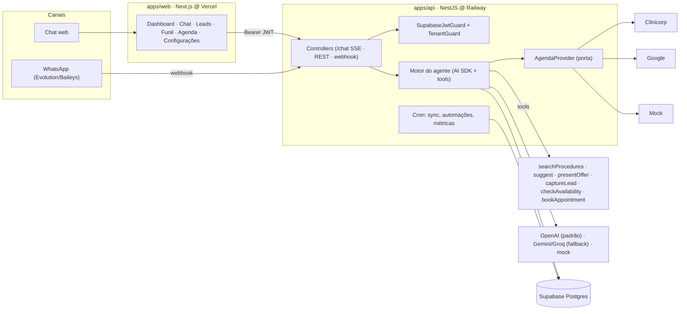
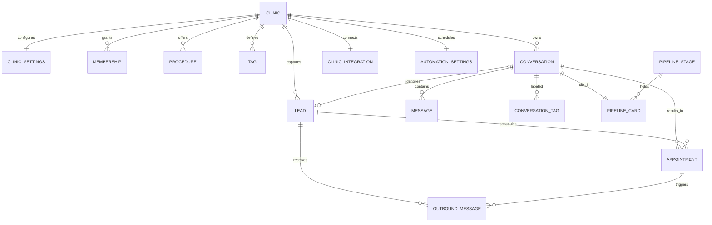

# DentalTrack — produto, arquitetura e estado atual

> **Documento único de referência.** Substitui `context.md` (especificação do MVP),
> `plan.md` (roadmap F0–F4) e `update.md` (diário de execução), que descreviam um
> produto que não existe mais: os três foram escritos entre junho e setembro de 2026
> e afirmavam, entre outras coisas, que o WhatsApp e a agenda real estavam *fora de
> escopo*. Ambos estão em produção. O histórico completo dos três continua no git.
>
> O **que fazer a seguir** está em [`maturity-plan.md`](maturity-plan.md); o
> **estado auditado** que o originou, em [`maturity-audit.md`](maturity-audit.md).
> Atualizado em: 2026-09-09.

---

## § Produto

**DentalTrack** é um CRM conversacional que coloca um **agente de IA** na linha de frente do atendimento de empresas de serviço de pequeno e médio porte. O agente atende no site e no WhatsApp, tira dúvidas, apresenta ofertas, captura o contato e **agenda de verdade** na agenda da empresa; a plataforma transforma cada conversa em dado estruturado (lead, tags de interesse, estágio do funil, temperatura) e devolve ao dono um painel acionável.

**O problema.** Empresas pequenas perdem clientes porque a mensagem chega fora do horário, a recepção está ocupada e a resposta demora — e a pessoa marca no concorrente. O dono não tem visibilidade de quantos chegaram, o que pediram e quantos viraram atendimento.

**A proposta.** Para o cliente final: resposta imediata, 24/7, que entende e já agenda. Para o dono: um atendente que não dorme, mais um painel que mostra leads, interesses e conversão em tempo real. O diferencial não é árvore de decisão — é um agente de linguagem natural configurável pela própria empresa.

### Personas

| Persona | Quem é | O que espera |
|---|---|---|
| **Dono** (administrador) | Proprietário ou gestor. Pouco tempo, sem time de marketing. | Configurar o agente em minutos e ver no painel o que está acontecendo. |
| **Recepção** (atendente) | Faz o atendimento hoje. | Que o agente filtre e qualifique; ela cuida só do que precisa de gente. |
| **Cliente final** | Pessoa interessada num serviço. | Conversa natural que resolve e agenda sem ligar. |

### Whitelabel

A marca visível é a da **empresa** (`settings.clinicName`, multi-tenant). A marca da **plataforma** (pré-login, `<title>`) vem de [`apps/web/lib/brand.ts`](../apps/web/lib/brand.ts). **Não hardcode o nome do produto nem defaults odontológicos** em prompt, copy, placeholder ou ícone — a especialização vem do campo `specialty` da empresa, e o produto atende igualmente bem uma clínica, uma barbearia ou um estúdio de estética. Regras completas em [`WHITELABEL.md`](WHITELABEL.md).

---

## § O que existe hoje

Tudo abaixo está **implementado, testado e em produção**.

### Atendimento

- **Agente de IA** com streaming, ferramentas (function calling) e prompt montado dinamicamente a partir da identidade, ofertas, instruções e catálogo da empresa.
- **Dois canais, um motor:** chat web e **WhatsApp** (Evolution/Baileys). As conversas dos dois caem no mesmo painel, funil e base de leads.
- **Entrada por voz:** o áudio *é* a mensagem do turno — transcrito no servidor (Gemini multimodal · Whisper no Groq · transcrição fixa no mock) e tratado como texto dali em diante.
- **Memória do contato:** o agente reconhece quem já conversou, cumprimenta pelo nome e não re-pergunta o que já sabe.
- **Ofertas com mídia:** imagem, vídeo, áudio ou catálogo enviados pelo WhatsApp no momento certo da conversa.

### CRM

- **Leads** com captura automática, temperatura (quente/médio/fraco por comportamento), detalhe com conversas e agendamentos, **exportação** (CSV/Excel/PDF) e **importação** de planilha.
- **Tags automáticas** de interesse (pré-filtro por palavra-chave + classificação por LLM com saída estruturada).
- **Funil kanban** com colunas por empresa, detector automático de estágio e arrastar-e-soltar.
- **Dashboard** com KPIs, funil de conversão, ranking de tags, abandono × recorrência e temperatura.
- **Central de notificações** derivada das tabelas existentes (sem tabela de eventos).

### Agenda e automações

- **Agenda real** atrás de uma porta (`AgendaProvider`) com três adapters: **Clinicorp**, **Google Agenda** e **mock** determinístico. Só um provedor ativo por empresa.
- O agente **consulta disponibilidade** e só diz "está marcado" quando gravou na agenda real.
- **Quatro automações** de relacionamento: lembretes 3d/1d/1h, aviso de atraso, remarcação após falta e retorno de manutenção — todas passando por uma fila idempotente com janela de horário, feriado, teto diário e jitter.
- **Opt-out persistido**, respeitado em todo envio.

### Plataforma

- **Multi-tenant** — toda query escopada por `clinicId`.
- **Pareamento do WhatsApp por QR na tela**, com o vínculo instância → empresa gravado sozinho.
- **Observabilidade** — logs estruturados em JSON, correlação por `requestId`, filtro global de exceções e captura no Sentry.
- **Produção** — web na Vercel, API e Evolution no Railway, Supabase gerenciado.

### Fora de escopo (decisões deliberadas)

Pagamentos · prontuário · financeiro · nota fiscal · app mobile nativo · disparos em massa · múltiplos idiomas · API oficial da Meta para WhatsApp (a decisão é Evolution/Baileys) · dark mode.

---

## § Arquitetura



**Dois princípios sustentam o desenho, e os dois já se provaram:**

1. ***Channel-agnostic*** — o motor não sabe se o canal é web ou WhatsApp. Web e WhatsApp são adapters de borda. Prova: o WhatsApp entrou **sem tocar no motor**.
2. **Ports & adapters na agenda** — nada acima da porta `AgendaProvider` sabe se a agenda é Clinicorp, Google ou simulada. Prova: o Google Agenda entrou sem tocar em nada acima da porta, e o modo `mock` permitiu construir e testar as automações **antes de a credencial do cliente existir**.

**Multi-tenant:** `SupabaseJwtGuard` (global) autentica; `TenantGuard` resolve o `clinicId` da membership e o injeta no request e no contexto de log.

---

## § Stack

Decidida. Não trocar sem motivo concreto.

| Camada | Escolha |
|---|---|
| **Monorepo** | pnpm + Turborepo · `apps/api` · `apps/web` · `packages/shared` |
| **Backend** | NestJS 11 · Prisma 7 · `@nestjs/schedule` · Jest |
| **Frontend** | Next.js 16 (App Router) · React 19 · Tailwind v4 · shadcn/ui · Recharts · lucide-react · TanStack Query · RHF + Zod · Vitest + Playwright |
| **IA** | Vercel AI SDK v6. **OpenAI** (`gpt-4o-mini`) como primário; **Gemini** e **Groq** como fallback; **`mock`** determinístico para testes — trocáveis por `LLM_PROVIDER` |
| **Dados & auth** | Supabase (Postgres gerenciado + Supabase Auth) |
| **Canal** | Evolution API (Baileys, **não-oficial, sem a API da Meta**) |
| **Observabilidade** | Logs JSON próprios + Sentry (opcional por `SENTRY_DSN`) |
| **Deploy** | web → Vercel · api + Evolution → Railway · Supabase gerenciado |

**Por que OpenAI como primário:** exigência de LGPD antes de PII real de pacientes — a API paga não treina com os dados por padrão, enquanto os *free tiers* usam. Gemini/Groq ficam como contingência.

**O que não voltar a usar:** Next.js monolito, Neon, Clerk, Drizzle, AI Gateway, Claude pago, API oficial da Meta.

---

## § Estrutura

```
dentaltrack/
├─ apps/
│  ├─ api/src/
│  │  ├─ ai/            motor: model · prompt · tools · tagging · stage-detection · transcribe
│  │  ├─ agenda/        fachada da agenda + sincronização
│  │  ├─ clinicorp/     porta AgendaProvider + adapter Clinicorp + integrações
│  │  ├─ google-agenda/ adapter Google Calendar
│  │  ├─ automations/   fila idempotente, planner, opt-out, feriados
│  │  ├─ whatsapp/      webhook, Evolution, conexão por QR
│  │  ├─ common/        contexto de correlação, logger, redação, filtro de exceções
│  │  ├─ auth/          SupabaseJwtGuard · TenantGuard · decorators
│  │  └─ jobs/          cron
│  └─ web/
│     ├─ app/(auth)/login · app/(app)/{dashboard,chat,leads,funil,agenda,settings}
│     ├─ components/{ui,charts,dashboard,settings,shell,whatsapp,funnel,agenda}
│     └─ hooks/ · lib/
├─ packages/shared/     schemas Zod + tipos (contrato BE↔FE)
└─ docs/
```

**Convenções.** Toda query carrega `clinicId`. Validação Zod compartilhada em toda mutação. Segredos só no backend. O motor do agente vive no NestJS. *Conventional commits*. Documentação e código em **PT-BR**.

---

## § Modelo de dados



| Entidade | Papel |
|---|---|
| `clinic` / `clinic_settings` | Tenant e sua configuração: persona, ofertas, mídia, disponibilidade, instância do WhatsApp. |
| `membership` | Vínculo usuário↔empresa, com `role` (`owner` \| `staff`). |
| `procedure` / `tag` | Catálogo (N:N) — alimenta o prompt e o auto-tagging. |
| `conversation` / `message` | Sessão de atendimento (canal, status, telefone) e cada turno. |
| `lead` | Pessoa capturada. Dedupe por telefone normalizado e por `externalId`. |
| `appointment` | Agendamento, com horário real, status, origem e id externo. |
| `conversation_tag` | Tag aplicada à conversa, com confiança. |
| `pipeline_stage` / `pipeline_card` | Colunas do funil e a posição de cada conversa. |
| `clinic_integration` | Provedor de agenda ativo, credenciais **cifradas** (AES-256-GCM) e último erro. |
| `automation_settings` / `outbound_message` / `contact_opt_out` / `holiday` | Regras de envio, fila idempotente, descadastro e calendário. |
| `daily_metric` | Pré-agregação diária que mantém o dashboard rápido. |

Schema completo em [`apps/api/prisma/schema.prisma`](../apps/api/prisma/schema.prisma).

---

## § Métricas

> Definições explícitas — o código as cita por esta seção.

| KPI | Definição | Cálculo |
|---|---|---|
| **Leads totais** | Pessoas capturadas no período. | `count(lead)` no recorte. |
| **Mensagens do agente (50 dias)** | Volume de respostas nos últimos 50 dias. | `count(message where role='assistant')` na janela. |
| **Taxa de resposta** | Quanto o agente é respondido. | conversas em que o cliente respondeu após a 1ª mensagem ÷ conversas iniciadas. |
| **Taxa de conversão** | Da 1ª mensagem até o agendamento. | conversas que chegaram a agendamento ÷ conversas iniciadas. |
| **Conversas em andamento** | Em aberto, sem conversão e não abandonadas. | `count(conversation where status='em_andamento')`. |
| **Não completadas** | Começaram e não agendaram nem seguem ativas. | `count(conversation where status='abandonada')`. |
| **Retenção** | Abandonados × recorrentes por dia. | Recorrente = lead que agendou e voltou a agendar **em outra conversa**. |
| **Temperatura** | Quente / médio / fraco por lead. | Score 0–100 de agendamento, engajamento, tags, recência e abandono. |

**Estados da conversa.** `em_andamento`: tem mensagem recente e não agendou. `agendada`: `bookAppointment` concluída (conversão). `abandonada`: sem atividade por N horas (cron) e sem agendamento. Transições permitidas em [`conversation-status.ts`](../apps/api/src/conversations/conversation-status.ts).

**Filtro de período:** 7 / 30 / **50** / 90 dias — o recorte padrão de mensagens é 50 dias.

---

## § Design

> **Fonte de verdade visual:** [`design_handoff_dentaltrack/`](design_handoff_dentaltrack/) — `styles/theme.css` (tokens), `README.md` e `QUICK_HANDOFF.md` são canônicos.

**A regra:** reproduzir o design **pixel-perfect** mantendo a stack. Não inventar cores, fontes ou espaçamentos; **sem dark mode** (tema light-only teal); sem emojis nem neon; ícones lucide.

As **cinco telas do handoff** (Login · Dashboard · Chat · Configurações · Leads) são réplica 1:1. As telas criadas depois — **Funil**, **Agenda** e as abas extras de Configurações (Procedimentos, Tags, WhatsApp, Automações, Integração) — não têm mockup e seguem o design system existente: os mesmos tokens, primitivos e espaçamentos. O código as marca com um comentário citando esta seção.

Tokens em `app/globals.css` (`@theme`): cores shadcn, `--chart-1..5`, `--tag-*`, status, `--radius` 0.7rem, sombras `xs..xl`. Fontes Geist e Geist Mono, com classe `tabular` para números. Acessibilidade AA: rótulos ligados a campos, navegação por setas em tablist, `role=log` no chat, foco visível, `prefers-reduced-motion`.

---

## § Qualidade

```bash
pnpm typecheck && pnpm lint && pnpm test && pnpm build
pnpm --filter @dentaltrack/web e2e   # Playwright — roda offline com LLM_PROVIDER=mock
```

Estado em 2026-09-09: **465 testes na API** (Jest, ao lado do código) e **145 no web** (Vitest), mais 5 fluxos de UI no Playwright. Não há CI — é o PR 11 do [plano de maturidade](maturity-plan.md), e até lá a verificação é local.

---

## § Rodar local

Pré-requisitos: Node 20+, pnpm 11, um projeto Supabase.

```bash
pnpm install
# Preencher apps/api/.env e apps/web/.env.local (ver .env.example de cada um)
pnpm --filter @dentaltrack/api db:deploy
pnpm --filter @dentaltrack/api db:seed
pnpm --filter @dentaltrack/api db:seed:demo   # dados de demonstração
pnpm dev                                       # web :3000 · api :3001
```

Crie uma conta em `/login` — o onboarding cria a empresa no primeiro acesso, de forma idempotente e à prova de corrida. Sem chave de IA, `LLM_PROVIDER=mock` responde de forma determinística.

**Runbooks:** [`WHATSAPP.md`](WHATSAPP.md) · [`CLINICORP.md`](CLINICORP.md) · [`GOOGLE_AGENDA.md`](GOOGLE_AGENDA.md) · [`DEPLOY.md`](DEPLOY.md) · [`WHITELABEL.md`](WHITELABEL.md).

---

## § Histórico

Condensado do antigo `update.md`, cujo diário completo — com o "por quê" de cada decisão e o que **não** deu para fazer em cada leva — permanece no git (`git log -- docs/update.md`).

| Data | Entrega |
|---|---|
| 2026-06-05 | **F0** Fundação: monorepo, tokens do design, shell, Supabase Auth, Prisma. |
| 2026-06-06 | **F1** Chatbot web ponta a ponta: streaming SSE, tools, auth multi-tenant, onboarding automático. |
| 2026-06-07 | **F2** Configurações, catálogo de procedimentos e tags (N:N) alimentando o prompt. |
| 2026-06-08 | **F3** Auto-tagging, métricas, cron, Dashboard e Leads. |
| 2026-06-09 | **F4** QA: Vitest, Playwright, conferência de fidelidade 1:1, acessibilidade AA. |
| 2026-06-10 | Entrada por voz (STT) — channel-agnostic desde o início. |
| 2026-06-11 | Temperatura de leads, detalhe do lead, OpenAI como provider primário. |
| 2026-06-14 | **F5** Canal WhatsApp (Evolution/Baileys) **validado ao vivo**. Entrou sem tocar no motor. |
| 2026-06-28 | Lembrete manual por WhatsApp disparado pelo CRM. |
| 2026-07-01 | Abandono × recorrência no dashboard; memória do contato no agente. |
| 2026-07-02 | **F6** Ofertas personalizadas com mídia (imagem/vídeo/áudio/catálogo). |
| 2026-07-14 | **F7** Funil kanban com detector automático de estágio. |
| 2026-08-26 | **Deploy em produção** (Vercel + Railway + Supabase) e **F8** exportação/importação de leads. |
| 2026-08-31 | **F9** Agenda com horário real, integração Clinicorp e quatro automações com fila idempotente. |
| 2026-09-01 | **F10** pareamento do WhatsApp por QR na tela · **F11** central de notificações · **F12** Google Agenda como provedor. |
| 2026-09-08 | **Auditoria de maturidade** — [`maturity-audit.md`](maturity-audit.md) e [`maturity-plan.md`](maturity-plan.md). |
| 2026-09-09 | **Observabilidade** (P0.3, PR 1 do plano de maturidade): correlação por `requestId`, logs JSON com redação de PII, filtro global de exceções, Sentry. |
| 2026-09-09 | Cartão "Assistente ativo" da sidebar virou dispensável, com a dispensa amarrada ao **login** (claim `session_id` do JWT) e não ao navegador — F5 e navegação não o trazem de volta; o próximo login traz. |

---

## § Onde estamos

O produto está funcionalmente completo e no ar. A etapa atual **não é de novas funcionalidades** — é de torná-lo confiável, operável e demonstrável por uma empresa real sem os desenvolvedores por perto, para entrar em validação comercial.

**O progresso vive no [Placar](maturity-plan.md#placar)** de [`maturity-plan.md`](maturity-plan.md): 12 PRs, com status e data de entrega por linha. Hoje, **2 de 12 concluídos** (auditoria e observabilidade). Cada PR atualiza a própria linha no mesmo commit da entrega — placar atualizado depois vira placar desatualizado.

**Riscos abertos, registrados honestamente:**

- **Disparo ativo no WhatsApp.** Com as automações da F9 o produto passou de receptivo a emissor. O canal é Baileys (não-oficial), e disparo ativo é o padrão que mais gera banimento. As mitigações estão embutidas (janela de envio, jitter, teto diário, opt-out persistido, idempotência, `AUTOMATIONS_ENABLED` como kill switch), mas o risco residual é decisão do dono, não técnica.
- **Clinicorp não validado ao vivo.** Os nomes de campo e rota do adapter vêm de um inventário não-oficial; o caminho de escrita nunca foi exercitado contra a API real. A credencial é pedida ao suporte **pelo dono da empresa**.
- **Sem reserva atômica de slot.** Nenhum dos provedores de agenda oferece. Duas conversas simultâneas podem fechar o mesmo horário; a re-checagem antes da escrita estreita a janela sem eliminá-la.

---

## § Glossário

**Agente** — o assistente de IA que conversa com o cliente. **Lead** — pessoa capturada pela conversa. **Conversão** — conversa que chega ao agendamento. **Tag** — rótulo de interesse aplicado à conversa. **Tenant / empresa** — unidade de isolamento de dados. **Channel-agnostic** — motor independente do canal. **Tool** — função que o agente chama. **Porta / adapter** — a interface (`AgendaProvider`) e suas implementações. **Idempotência** — executar duas vezes produz o mesmo efeito de executar uma.
