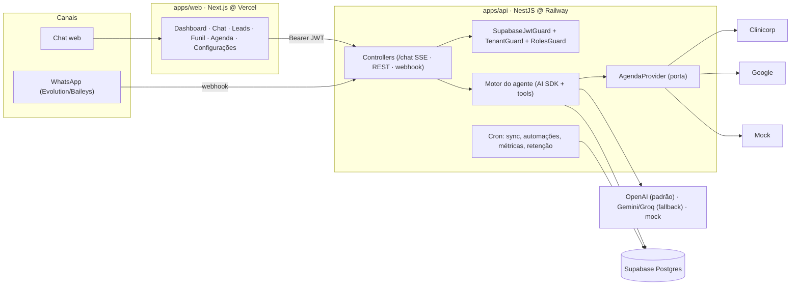
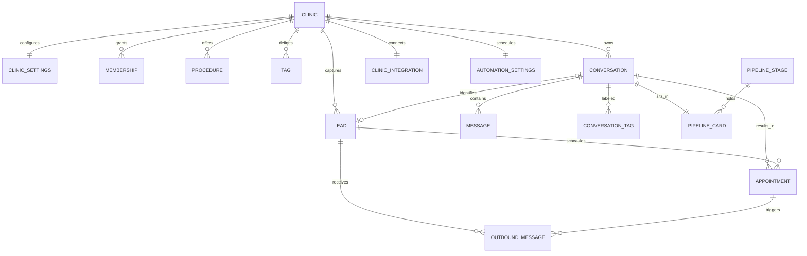

# DentalTrack — produto, arquitetura e decisões

> O **que** é o produto, **como** ele é construído e **por que** as decisões que valem hoje foram tomadas.
> Os outros três documentos: [`engenharia.md`](engenharia.md) (como mexer no código),
> [`operacao.md`](operacao.md) (como rodar em produção) e [`roadmap.md`](roadmap.md) (o que falta).
> Idioma: PT-BR. Atualizado em 2026-09-17.

---

## § Produto

**DentalTrack** é um CRM conversacional que coloca um **agente de IA** na linha de frente do atendimento de empresas de serviço de pequeno e médio porte. O agente atende no site e no WhatsApp, tira dúvidas, apresenta ofertas, captura o contato e **agenda de verdade** na agenda da empresa. A plataforma transforma cada conversa em dado estruturado (lead, tags, estágio do funil, temperatura) e devolve ao dono um painel acionável.

**O problema.** A mensagem chega fora do horário, a recepção está ocupada, a resposta demora e a pessoa marca no concorrente. O dono não sabe quantos chegaram, o que pediram nem quantos viraram atendimento.

**A proposta.** Resposta imediata, 24/7, que entende e já agenda. Para o dono, um painel com leads, interesses e conversão em tempo real. O diferencial é um agente de linguagem natural configurável pela própria empresa, não uma árvore de botões.

| Persona                  | Quem é                                          | O que espera                                                      |
| ------------------------ | ----------------------------------------------- | ----------------------------------------------------------------- |
| **Dono** (administrador) | Proprietário ou gestor, sem time de marketing.  | Configurar o agente em minutos e ver no painel o que acontece.    |
| **Recepção** (atendente) | Faz o atendimento hoje.                         | Que o agente filtre e qualifique; ela cuida do que precisa de gente. |
| **Cliente final**        | Pessoa interessada num serviço.                 | Conversa natural que resolve e agenda sem ligar.                  |

**Whitelabel.** O nome nasceu odontológico, mas o produto atende igualmente uma clínica, uma barbearia ou um estúdio de estética. A marca visível é a da **empresa** (`settings.clinicName`, logo por upload); a marca da **plataforma** (pré-login, `<title>`) vem de `apps/web/lib/brand.ts`. A especialização vem do campo `specialty`. Regras para quem escreve código em [`engenharia.md` § Whitelabel](engenharia.md#-whitelabel).

---

## § O que existe hoje

Tudo abaixo está implementado, testado e **em produção** desde 2026-08-26.

**Atendimento**

- Agente de IA com streaming, function calling e prompt montado a partir da identidade, ofertas, instruções e catálogo da empresa. Data de hoje e dados já conhecidos do contato entram no prompt (cumprimenta pelo nome, não re-pergunta).
- Dois canais, um motor: chat web e WhatsApp (Evolution/Baileys). Conversas dos dois caem no mesmo painel, funil e base de leads.
- Entrada por voz: o áudio é a mensagem do turno, transcrito no servidor.
- Ofertas com mídia (imagem, vídeo, áudio, PDF) enviadas pelo WhatsApp no momento certo; logo e mídia por upload (Supabase Storage) ou por URL.
- O agente consulta disponibilidade real, agenda com horário, e **desmarca de verdade** (`findMyAppointments` + `cancelAppointment`, escopadas ao contato da conversa).

**CRM**

- Leads com captura automática, temperatura (quente/médio/fraco), detalhe com conversas e agendamentos, exportação (CSV/Excel/PDF) e importação de planilha.
- Tags automáticas de interesse (pré-filtro por palavra-chave + classificação por LLM com saída estruturada).
- Funil kanban com colunas por empresa, detector automático de estágio (só avança, nunca regride) e arrastar-e-soltar.
- Dashboard com KPIs, funil, ranking de tags, abandono × recorrência, temperatura e agendamentos do período.
- Central de notificações derivada das tabelas existentes (sem tabela de eventos).
- Handoff humano: o dono assume a conversa do WhatsApp, a IA pausa, as automações são suprimidas; devolve quando quiser.
- Checklist de onboarding no dashboard, derivado das tabelas.

**Agenda e automações**

- Agenda real atrás de uma porta (`AgendaProvider`) com três adapters: **Clinicorp**, **Google Agenda** e **mock** determinístico. Um provedor ativo por empresa.
- Quatro automações: lembretes 3d/1d/1h, aviso de atraso, remarcação após falta e retorno de manutenção, todas por uma fila idempotente com janela de horário, feriado, teto diário e jitter.
- Cancelar e remarcar pela tela `/agenda`. Opt-out persistido.

**Plataforma**

- Multi-tenant (toda query escopada por `clinicId`); papéis `owner` e `staff`.
- Pareamento do WhatsApp por QR na tela, com o vínculo instância → empresa gravado sozinho.
- Observabilidade: logs JSON, correlação por `requestId`, redação de PII, Sentry opcional, `GET /health`.
- LGPD operacional: anonimização a pedido, opt-out visível, retenção opcional.

**Fora de escopo (decisão):** pagamentos · prontuário · financeiro · nota fiscal · app mobile · disparos em massa · múltiplos idiomas · API oficial da Meta (a decisão é Evolution/Baileys) · dark mode.

---

## § Arquitetura



Dois princípios sustentam o desenho, e os dois já se provaram:

1. **Channel-agnostic.** O motor não sabe se o canal é web ou WhatsApp; os dois são adapters de borda sobre o mesmo `ChatService`. O WhatsApp entrou sem tocar no motor.
2. **Ports & adapters na agenda.** Nada acima de `AgendaProvider` sabe qual agenda é. O Google entrou sem tocar acima da porta, e o modo `mock` permitiu construir e testar as automações antes de existir credencial de cliente.

**Multi-tenant.** `SupabaseJwtGuard` (global) autentica; `TenantGuard` resolve `clinicId` e `role` da membership e os injeta no request e no contexto de log; `RolesGuard` lê `@Roles('owner')`.

### Stack (decidida — não trocar sem motivo concreto)

| Camada          | Escolha                                                                                                                  |
| --------------- | ------------------------------------------------------------------------------------------------------------------------ |
| Monorepo        | pnpm + Turborepo · `apps/api` · `apps/web` · `packages/shared`                                                           |
| Backend         | NestJS 11 · Prisma 7 · `@nestjs/schedule` · Jest                                                                         |
| Frontend        | Next.js 16 (App Router) · React 19 · Tailwind v4 · shadcn/ui · Recharts · lucide-react · TanStack Query · RHF + Zod · Vitest + Playwright |
| IA              | Vercel AI SDK v6 · **OpenAI** `gpt-4o-mini` primário · Gemini e Groq como fallback · `mock` para testes (`LLM_PROVIDER`)  |
| Dados & auth    | Supabase (Postgres + Auth + Storage)                                                                                     |
| Canal           | Evolution API (Baileys, não-oficial, **sem a API da Meta**)                                                              |
| Observabilidade | Logs JSON próprios + Sentry (opcional)                                                                                   |
| Deploy          | web → Vercel · api + Evolution → Railway · Supabase gerenciado                                                           |

**Por que OpenAI como primário:** LGPD. A API paga não treina com os dados; os free tiers usam. **O que não voltar a usar:** Next.js monolito, Neon, Clerk, Drizzle, AI Gateway, Claude pago, API oficial da Meta.

### Estrutura

```
apps/api/src/
  ai/            motor: model · prompt · tools · tagging · stage-detection · transcribe
  agenda/        fachada da agenda, chaves de idempotência, sincronização
  clinicorp/     porta AgendaProvider + adapter Clinicorp + IntegrationService
  google-agenda/ adapter Google Calendar (JWT de service account via node:crypto)
  automations/   fila idempotente, planner, opt-out, feriados
  whatsapp/      webhook, transporte Evolution, conexão por QR
  conversations/ conversas, handoff, status
  leads/         leads, scoring, export/import, privacidade (LGPD)
  media/         upload para o Supabase Storage
  common/        request-context, logger, redação, filtro de exceções, http-retry
  auth/          SupabaseJwtGuard · TenantGuard · RolesGuard · decorators
  jobs/          cron
apps/web/
  app/(auth)/login · app/(app)/{dashboard,chat,leads,funil,agenda,settings}
  components/{ui,charts,dashboard,settings,shell,whatsapp,funnel,agenda,brand}
  hooks/ · lib/
packages/shared/  schemas Zod + tipos: o contrato BE↔FE
```

---

## § Modelo de dados



| Entidade                                                | Papel                                                                                                   |
| ------------------------------------------------------- | ------------------------------------------------------------------------------------------------------- |
| `clinic` / `clinic_settings`                            | Tenant e configuração: persona, logo, ofertas, mídia, instância e estado do WhatsApp, `notifications_seen_at`. |
| `membership`                                            | Usuário ↔ empresa, com `role` (`owner` \| `staff`).                                                     |
| `procedure` / `tag`                                     | Catálogo (N:N). Alimenta o prompt e o auto-tagging.                                                     |
| `conversation` / `message`                              | Sessão (canal, status, telefone, `handoffAt`) e cada turno.                                             |
| `inbound_message`                                       | Dedupe persistente do webhook do WhatsApp.                                                              |
| `lead`                                                  | Pessoa capturada. Dedupe por telefone normalizado e `externalId`.                                       |
| `appointment`                                           | Agendamento com horário real, status, origem, `externalId`, `bookingKey`, `canceledAt`.                 |
| `conversation_tag`                                      | Tag aplicada à conversa, com confiança.                                                                 |
| `pipeline_stage` / `pipeline_card`                      | Colunas do funil e a posição de cada conversa.                                                          |
| `clinic_integration`                                    | Provedor ativo, credenciais cifradas (AES-256-GCM), última verificação e erro.                          |
| `automation_settings` / `outbound_message` / `contact_opt_out` / `holiday` | Regras de envio, fila idempotente (`dedupeKey`), descadastro e calendário.           |
| `daily_metric`                                          | Pré-agregação diária do dashboard.                                                                      |

Schema completo em [`apps/api/prisma/schema.prisma`](../apps/api/prisma/schema.prisma). Migrations nomeadas por feature (`init` → … → `f19_clinic_logo`), todas aditivas.

---

## § Métricas

> Definições explícitas. O código as cita por esta seção.

| KPI                            | Definição                                    | Cálculo                                                                          |
| ------------------------------ | -------------------------------------------- | -------------------------------------------------------------------------------- |
| **Leads totais**               | Pessoas capturadas no período.               | `count(lead)` no recorte.                                                        |
| **Mensagens do agente**        | Respostas nos últimos 50 dias.               | `count(message where role='assistant')` na janela.                               |
| **Taxa de resposta**           | Quanto o agente é respondido.                | conversas com resposta do cliente após a 1ª mensagem ÷ conversas iniciadas.      |
| **Taxa de conversão**          | Da 1ª mensagem até o agendamento.            | conversas `agendada` ÷ conversas iniciadas.                                      |
| **Conversas em andamento**     | Em aberto, sem conversão, não abandonadas.   | `status='em_andamento'`.                                                         |
| **Não completadas**            | Nem agendaram nem seguem ativas.             | `status='abandonada'`.                                                           |
| **Retenção**                   | Abandonados × recorrentes por dia.           | Recorrente = lead que agendou e voltou a agendar **em outra conversa**.          |
| **Temperatura**                | Quente / médio / fraco por lead.             | Score 0–100 de agendamento, engajamento, tags, recência e abandono.              |
| **Agendamentos do período**    | Registrados × de pé × cancelados.            | `Appointment` no recorte; cancelados por `canceledAt`.                           |

**Estados da conversa.** `em_andamento`: tem mensagem recente e não agendou. `agendada`: `bookAppointment` concluída (conversão, estado terminal). `abandonada`: sem atividade por `ABANDON_AFTER_HOURS` (cron) e sem agendamento. Transições em `conversations/conversation-status.ts`.

**Cancelar não desfaz a conversão.** A conversa converteu e o agente fez o trabalho; o que o dashboard mostra ao lado do funil é a outra metade: agendamentos registrados × de pé × cancelados. População diferente (agendamentos, não conversas), por isso os números não batem com o funil.

**Filtro de período:** 7 / 30 / **50** / 90 dias.

---

## § Design

> **Fonte de verdade visual:** [`design_handoff_dentaltrack/`](design_handoff_dentaltrack/) — `styles/theme.css` (tokens) e `README.md`.

Reproduzir o design **pixel-perfect** mantendo a stack. Não inventar cores, fontes ou espaçamentos; tema teal **light-only**; sem emojis nem neon; ícones lucide.

As cinco telas do handoff (Login · Dashboard · Chat · Configurações · Leads) são réplica 1:1. As telas criadas depois (**Funil**, **Agenda**, abas extras de Configurações) não têm mockup e seguem o design system existente: mesmos tokens, primitivos e espaçamentos. O código as marca com um comentário citando esta seção.

**Movimento (desde 2026-09-19, revisão pelas skills `apple-design`, `emil-design-eng` e `better-ui`, versionadas em `.claude/skills/`).** Animação de entrada só na primeira pintura (a troca de período mantém o dado anterior e só troca os números no lugar); gráficos sem animação de dados; hover apenas em superfícies clicáveis, e toda superfície clicável responde no *pointer-down*; transições nomeiam as propriedades que mudam, com ease-out forte (`cubic-bezier(0.23, 1, 0.32, 1)`) e abaixo de 300ms; `prefers-reduced-motion` troca deslocamento por fade, sem zerar cor e opacidade; a topbar é material translúcido com a borda só quando há conteúdo por baixo, e cai para superfície sólida em `prefers-reduced-transparency`/`prefers-contrast`. Os tokens e o layout do handoff não mudam.

Tokens em `app/globals.css` (`@theme`): cores shadcn, `--chart-1..5`, `--tag-*`, status, `--radius` 0.7rem, sombras `xs..xl`. Fontes Geist e Geist Mono, classe `tabular` para números. Acessibilidade AA: rótulos ligados a campos, setas em tablist, `role=log` no chat, foco visível, `prefers-reduced-motion`.

**Fidelidade 1:1 é sobre aparência.** Todo controle vindo do handoff precisa de comportamento por trás e de um teste que clique nele; controle inerte não entra na tela (ver [`engenharia.md`](engenharia.md#-regras-aprendidas-com-defeitos-de-produção)).

---

## § Decisões de desenho que valem hoje

Cada item abaixo é uma decisão tomada com motivo. Mudar exige um motivo melhor, escrito.

### Agenda

- **`book()` grava o pedido local antes de chamar o provedor** e reconcilia a mesma linha com o `externalId` depois. A ordem inversa deixava o horário ocupado na agenda real e nada no banco quando havia timeout, e o retry criava o segundo. A dedupe é a `bookingKey` (contato + quando + o quê) sob índice único; colisão devolve o agendamento existente sem segunda escrita externa. **Sem advisory lock**: o índice único já é o controle de concorrência.
- **O status inicial é `agendado`**, não `pedido`. Nascer `pedido` faria empresas sem integração pararem de receber lembretes (o planner filtra por `agendado`/`confirmado`).
- **`book()` re-checa o horário antes de gravar, fail-open.** Só é conflito se a agenda respondeu com lista não-vazia sem o horário; conflito rebaixa a linha para `pedido` e o agente oferece outro horário. Lista vazia ou erro segue e cria, porque a autoridade final é o provedor. **Não há reserva atômica de slot** em nenhum provedor; a janela ficou menor, não zero.
- **Cancelar e remarcar escrevem no provedor antes do banco**, o inverso do `book()`: o que não pode acontecer é a agenda da empresa continuar ocupada com um horário que o produto diz estar livre. Se o provedor recusa, nada muda localmente e a tela recebe 503. Idempotentes por transição: cancelar o cancelado é no-op de sucesso.
- **O Clinicorp remarca cancelando e recriando** (não há rota de reagendamento); o `externalId` muda. Falhar no meio libera o horário antigo sem criar o novo: isso tem tipo próprio (`AgendaSlotReleasedError`) e a linha vira `pedido` sem id externo, para nenhum lembrete sair prometendo consulta que não existe.
- **Retry só em leitura.** `createEvent`/`create_appointment_by_api` nunca repetem (é assim que se duplica agendamento; a recuperação de escrita é a `bookingKey`). `freeBusy` é `POST` e repete; `events.delete` repete porque é idempotente por contrato. A decisão é do chamador, não do verbo HTTP.
- **Toda falha de agenda tem categoria** (`AgendaProviderError.kind`: `auth | config | indisponivel | timeout | resposta_invalida | conflito | desconhecido`) mais o status HTTP. Só `conflito` muda a conduta do agente; o resto é problema nosso e ele promete o retorno da equipe.
- **Um provedor ativo por empresa.** Ligar um desliga o outro.
- **Na `/agenda`, a cor é sempre a do profissional.** Houve um seletor "por profissional · por procedimento" (2026-09-18 → 09-19); saiu porque a recepção precisa ver de relance *quem* atende, e o procedimento já está escrito no bloco e no filtro. Posição no cadastro → paleta de charts, estável quando alguém entra ou sai; legenda só com equipe de 2+.
- **Clicar num agendamento abre o painel dele, e é lá que se age.** Um lugar só para detalhes, WhatsApp do contato, lembrete pelo CRM (exige a conversa de origem — agendamento vindo da integração não tem), ver a conversa, remarcar e cancelar. Cancelar e remarcar continuam sendo da equipe, não do agente (P0.5).
- **Google: uma service account no servidor**, e cada empresa compartilha a agenda dela com esse e-mail. OAuth por empresa exigiria verificação do app pelo Google e teria refresh token expirando no meio de uma sincronização. O Google não registra presença, então falta e retorno de manutenção não disparam com ele; lembretes funcionam.
- **O agente cancela, mas só o que é do contato.** `findMyAppointments` busca pelo lead da conversa ou pela própria conversa, **nunca por telefone** (o celular da família é compartilhado). `cancelAppointment` revalida o id contra essa lista: o id chega como texto gerado por um modelo. Falha do provedor devolve `ok:false` com a instrução de não prometer o cancelamento.
- **Remarcar é cancelar + agendar**, sem tool direta: `bookAppointment` re-checa o horário, e uma tool de remarcação pularia essa checagem.
- **Nenhuma tool declara objeto de parâmetros vazio.** O Gemini recusa `properties: {}` com 400, e ele é o fallback. Um teste em `ai/tools.spec.ts` proíbe.

### Fila de saída e WhatsApp

- **Fila idempotente** (`OutboundMessage.dedupeKey` sob índice único). `dispatchDue` reivindica cada linha (`pendente → enviando` por `updateMany`, prossegue só com `count === 1`); claims presos há mais de 10 min voltam a `pendente` (nesse caso raro a mensagem pode sair duas vezes; nunca sair é pior). `enqueue` trata `P2002` em vez de check-then-create.
- **Salvaguardas anti-ban não alcançam resposta reativa.** Janela de horário, feriado, teto diário e `AUTOMATIONS_ENABLED` existem para conter iniciativa nossa, não resposta a quem escreveu. `REACTIVE_KINDS` em `outbound.service.ts` é a lista; toda salvaguarda a consulta, tanto no que bloqueia quanto no que conta.
- **Resposta reativa que falha no envio direto cai na fila** (`kind: resposta_ia`), e a fila não persiste outra mensagem `assistant` (o `ChatService` já gravou).
- **Dedupe de entrada é persistente e insert-first** (`InboundMessage`), antes de qualquer processamento. Fail-open: erro que não seja `P2002` processa (responder duas vezes é melhor que nunca).
- **Sem reconexão em laço.** Sessão expirada de Baileys exige QR; uma tentativa por instância a cada 15 min, fora disso detectar, avisar e oferecer o botão. Estado persistido em `ClinicSettings.whatsappState` por endpoint e por cron de 5 min. O alerta só aparece em `desconectado`, nunca durante o pareamento.
- **Handoff é ortogonal ao status** (`Conversation.handoffAt`), não um estado novo: uma conversa `agendada` também pode precisar de gente. O gate fica no `ChatService.processInboundMessage`; a mensagem do cliente continua persistida e o lead capturado. Opt-out é checado antes do gate. **Só canais sem login** suportam handoff (`HANDOFF_CHANNELS` no `shared`; a API recusa com 422 e a tela não oferece).
- **O nome da instância é derivado da empresa** (`slug-<id8>`), nunca aceito do cliente: é ele que o webhook usa para resolver o tenant.
- **Bucket de mídia público de propósito.** A Evolution busca a mídia pela URL sem as nossas credenciais; URL assinada expiraria numa configuração salva por meses. O caminho (`<clinicId>/<finalidade>/<uuid>.<ext>`) nunca vem do cliente. **SVG é recusado na logo** (XML que pode conter script).

### Dados, LGPD e permissões

- **Anonimização, não exclusão.** A linha do lead sustenta histórico, agendamentos e métricas que não são do titular. Saem nome, telefone, e-mail, `externalId`, `contactPhone` das conversas, conteúdo das mensagens e corpo das mensagens de saída; `Appointment` fica com `preferredTime` limpo; o lead recebe um nome genérico. A busca é por `leadId` **ou** telefone em todas as variantes: as conversas sem vínculo são exatamente as que um pedido de eliminação cobra.
- **`ContactOptOut` é mantido na anonimização.** Aquele telefone é o que impede reenviar para quem pediu para parar.
- **Retenção nasce desligada** e alcança só a fila de saída finalizada; piso de 30 dias. Apagar dado de cliente sem ele pedir é pior do que guardar demais.
- **Logs redigem telefone e e-mail automaticamente; conteúdo de mensagem nunca é logado.**
- **Mutações administrativas são owner-only** (`RolesGuard`); `GET /settings` fica aberto ao staff porque o shell e o chat leem nome, persona e saudação. Reativar envio para quem descadastrou é decisão de dono (`PUT /leads/:id/opt-out`).
- **Papel desconhecido é um terceiro estado** (`Role | null`), otimista na UI: a barreira real é o `RolesGuard`. Começar em `staff` rebaixava o dono sempre que o bootstrap falhava.

### Observabilidade e operação

- **Correlação por `requestId`** via `AsyncLocalStorage`; o front envia e exibe o `x-request-id`, então o código que o usuário vê é o que está no log. O webhook usa o `messageId` como `requestId`, o que torna a reentrega visível.
- **`GET /health` é global e sem chamada externa** (versão, WhatsApp, arquivos, monitoramento por `isConfigured()`). Estado por empresa num endpoint público vazaria dado; depender da Evolution derrubaria o serviço inteiro quando só o WhatsApp caiu.
- **O filtro de exceções não escreve nada depois que a resposta começou** (o `/chat` é SSE).
- **Checklist de onboarding e notificações são derivados das tabelas existentes**, sem tabela de eventos. "Automações revisadas" usa `reviewedAt`, preenchido só por salvamento humano.
- **Seeds da demo usam DDD 00**: um ambiente apontado para um WhatsApp real não pode alcançar o número de alguém.

---

## § Histórico (resumo)

O diário completo, com o porquê de cada leva, está no git.

| Data       | Entrega                                                                                        |
| ---------- | ---------------------------------------------------------------------------------------------- |
| 2026-06-05 → 06-09 | **F0–F4** Fundação, chatbot web E2E, configurações/catálogo, auto-tagging + dashboard + leads, QA (Vitest, Playwright, a11y). |
| 2026-06-10 → 07-02 | Voz (STT), temperatura de leads, OpenAI como primário, **F5** WhatsApp (validado ao vivo em 06-14), memória do contato, **F6** ofertas com mídia. |
| 2026-07-14 | **F7** Funil kanban com detector de estágio.                                                   |
| 2026-08-26 | **Deploy em produção** (Vercel + Railway + Supabase) · **F8** export/import de leads.          |
| 2026-08-31 → 09-01 | **F9** agenda real + Clinicorp + automações · **F10** QR na tela · **F11** notificações · **F12** Google Agenda. |
| 2026-09-08 → 09-11 | **Etapa de maturidade, PRs 1–10:** observabilidade, idempotência do agendamento, cancelar/remarcar + claim da fila, agenda endurecida, handoff, WhatsApp robusto, estados de erro, permissões, LGPD, onboarding + demo. Regressão de boot da API corrigida (ver `engenharia.md`). |
| 2026-09-14 → 09-16 | **F13** upload de logo e mídia · **F14** o agente desmarca de verdade · agendamentos do período no dashboard · chave do Storage validada em produção. |
| 2026-09-17 | Logo da empresa no shell · documentação consolidada em quatro arquivos.                        |

---

## § Glossário

**Agente** — o assistente de IA que conversa com o cliente. **Lead** — pessoa capturada pela conversa. **Conversão** — conversa que chega ao agendamento. **Tag** — rótulo de interesse aplicado à conversa. **Tenant / empresa** — unidade de isolamento de dados. **Channel-agnostic** — motor independente do canal. **Tool** — função que o agente chama. **Porta / adapter** — a interface (`AgendaProvider`) e suas implementações. **Idempotência** — executar duas vezes produz o efeito de executar uma. **Handoff** — atendente humano assume a conversa e a IA pausa. **Resposta reativa** — resposta do agente a quem acabou de escrever, em oposição a disparo ativo (automação).
